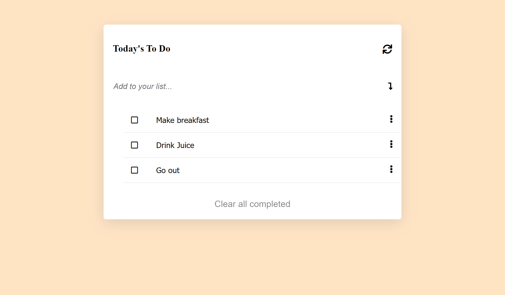

# To Do list

> "To-do list" is a tool that helps to organize your day. It simply lists the things that you need to do and allows you to mark them as complete. You will build a simple website that allows for doing that, and you will do it using ES6 and Webpack!



## Live Demo

[Live Demo Link](https://myelin0.github.io/todolist/?)

## Built With

-Javascript
-Css
-Html
-Webpack

## Getting Started

after cloning

```
npm install
npm start
```
## Authors

👤 **Emirjeta Veisllari**

- GitHub: [@myelin0](https://github.com/myelin0)
- Twitter: [@Amy_Albania](https://twitter.com/Amy_albania)
- LinkedIn: [@Emirjeta Veisllari](https://www.linkedin.com/in/emirjeta-veisllari/)
## 🤝 Contributing

Contributions, issues, and feature requests are welcome!

Feel free to check the [issues page](https://github.com/myelin0/todolist/issues).

## Show your support

Give a ⭐️ if you like this project!

## Acknowledgments

- Hat tip to anyone whose code was used
- Inspiration
- etc

## 📝 License

This project is [MIT](./MIT.md) licensed.
